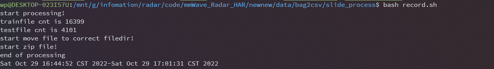

**功能:**

将数据进行二级滑动窗口，并且记录数据

**(数据维度为6，包含{x,y,z,velocity,bearing,intensity})**


其中可以设定参数为:

1. `二级窗口中固定点数`
2. `一级窗口大小`
3. `二级窗口大小`
4. `一级窗口滑动系数`
5. `二级窗口滑动系数`


文件夹`to_txt`保存着txt的数据文件,其中含有训练集`train`和测试集`test`

文件夹`har_train_frame`装滑动窗口后的训练集

文件夹`har_test_frame`装滑动窗口后的测试集

```
.
├── README.md
├── data_preprocessing.py
├── dataset
│   ├── class_name.csv
│   ├── data_preprocessing.py
│   ├── test_data_names.csv
│   ├── train_data_names.csv
│   ├── boxing
│   ├── jack
│   ├── jump
│   ├── squats
│   ├── walk
│   └── wave
├── har_test_frame
├── har_train_frame
├── start.sh
├── ti_mmwave_rospkg.py
└── to_txt
    ├── test
    │   ├── boxing.csv
    │   ├── jack.csv
    │   ├── jump.csv
    │   ├── squats.csv
    │   ├── walk.csv
    │   └── wave.csv
    └── train
        ├── boxing.csv
        ├── jack.csv
        ├── jump.csv
        ├── squats.csv
        ├── walk.csv
        └── wave.csv

```


## 使用方法

**注意，要下载数据，需要使用[lfs](https://git-lfs.github.com/)命令**

`git lfs clone https://github.com/JUSTWILLPOWER/TwoStage_sliding_processing.git`

`bash ./start.sh`

文件最后会将数据放在dataset文件夹中，并进行zip打包

 
